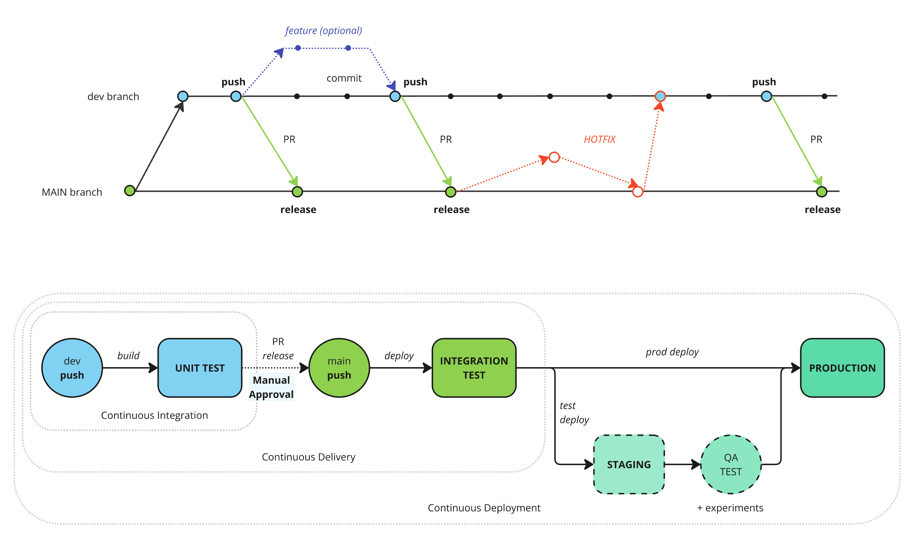

## Table of Contents

**[1. Coding Guidelines](#heading--1)**

**[2. CI/CD Workflow](#heading--2)**

**[3. References](#heading--3)**

----


<div id="heading--1"/>

# Coding Guidelines

## Names

If there is one thing to remember from *PEP 8*, let it be this. Easy and effective:

* *Variables*: Use lowercase letters and underscores to separate words
* *Functions*: Use lowercase letters and underscores to separate words
* *Classes*: capitalize the first letter of each word (*CapWords*)
* *Constants*: Use capital letters and underscores to separate words
* If you need to use a reserved word, add an underscore at the end
* Avoid using overly short names like `fn`; write `first_name` instead
* Never use lowercase `l`, uppercase `O`, or uppercase `I` as a variable name; they are easily confused with `1` or `0`

```python
students = 10 # Variable

def calculate_area(length_x, length_y): # Function
 return length_x * length_y

class FlyingPig: # Class
 weight = 25

PI = 3.1415927 # Constant

class_ = 'Mammal' # I'm stubborn about using 'class' as a variable name"
```

## Indentation

Since Python uses indentation rather than braces to denote the scope of a code block, it is critical to have a clean and consistent indentation style:

*The guidelines aren't too strict, with multiple options; the key is to pick a convention and stick to it.
* *PEP 8* puts an end to the spaces vs. tabs debate, recommending four spaces instead of one tab character.
* Always indent code that spans multiple lines to improve readability
* For long lists of values, either indent based on the opening delimiter (*opening delimiter*) or use a hanging indent (*hanging indent*)
*When using *hanging indents*, there must be no value on the first line and an extra level of indentation must be added if there is a block below
* In the case of multi-line statements, the closing symbol may be aligned with the indentation used or with the first character of the statement

```python
# This block does not compile! It is just for example purposes

# Long list of values ​​with 'opening delimiter'
result = my_function(first_argument, second_argument,
 third_argument, fourth_argument)

# Long list of values ​​with 'hanging indent'
result = my_function(
 first_argument, second_argument,
 third_argument, fourth_argument)

# Long list of values ​​with 'hanging indent' and block below
def my_function(
 first_argument, second_argument,
 third_argument, fourth_argument):
 print(first_argument)

# Align multiline statement to whitespace
my_list = [
 1, 2, 3,
 4, 5, 6,
 ]

# Align multiline statement to first character
my_list = [
 1, 2, 3,
 4, 5, 6,
]
```      
      
## Whitespace and line breaks

PEP 8 has pretty strict guidelines about when to split long lines and add whitespace.

Use the following guidelines as a starting point; the most important thing is to stay consistent.

Line break criteria:

* It is recommended not to include multiple instructions on the same line
* Keep line lengths under 79 characters
* Use two blank lines before and after function and class definitions
* Use a blank line before and after the definition of a class method
* Use a blank line to separate logical steps in long sequences

Criteria for whitespace:

* Avoid unnecessary whitespace
* Avoid whitespace immediately inside parentheses, braces, or brackets
* Use whitespace around assignment and logical operators
* Do not use whitespace in assigning values to default parameters
* Use spaces around mathematical operators to clarify the order of operations
* Use whitespace after commas and colons if they are not adjacent to the end of a bracket, brace, or parentheses
* When using `:` to split a list, no spaces should be used
* Do not use whitespace to align variable values

```python
# This block does not compile! It is just for example purposes

# Whitespace inside parentheses, braces, and brackets
spam(ham[1], {eggs: 2}) # Good
spam ( ham[ 1 ], { eggs: 2 } ) # Bad

# Whitespace in assignment and logical operators
egg = 12 # Good
egg=12 # Bad

# Whitespace in default parameter assignment
def complex(real, imag=0.0): # Good
 return magic(r=real, i=imag) # Good

def complex(real, imag = 0.0): # Bad
 return magic(r = real, i = imag) # Wrong

# Whitespace in mathematical operators
hypot = x*x + y*y # Good
c = (a+b) * (ab) # Good

hypot = x * x + y * y # Bad
c = (a + b) * (a - b) # Bad

# Whitespace after commas and periods
x, y = y, x # Good
x , y = y , x # Bad

# Whitespaces with ':'
my_list[2:5] = 10 # Good
my_list[2 : 5] = 10 # Bad

# Whitespace to align variable values
user_name = 'Pepito' # Mal
user_country = 'Spain'
```

## Single quotes or double quotes?

Both single quotes (`'`) and double quotes (`\"`) are used to define string values.
Also, triple quotes (`'''` or `"""`) are used for strings that span multiple lines.

Usually, single quotes are used for short fixed strings while double for longer texts, as long as they do not contain
double quotes.

Python does not advocate single or double quotes, but it does provide usage guidelines:

* Use double quotes for strings containing single quotes
* Use single quotes for double-quoted strings

```python
# All of these examples are correct

message = 'Somewhere in "La Mancha"'

message = "In a place in 'La Mancha'"

message = '''In a place in "La Mancha", whose name I do not want to remember,
Not long ago there lived a gentleman of the lance-yard variety,
ancient shield, a skinny nag and a racing greyhound'''

message = """ In a place in 'La Mancha', whose name I do not want to remember,
Not long ago there lived a gentleman of the lance-yard variety,
an ancient shield, a skinny nag and a greyhound for racing 
"""

```

## Comments

Keep comments up to date; bad comments are worse than no comments at all:

* Write complete sentences
* A comment starts with `#` followed by a space
* Block comments:
    * One or more comment lines starting with `#`
    * They must be indented at the height of the code they are commenting
    * Separate paragraphs in the comment with an empty comment line
* Inline comments (`inline comments`):
    * They follow the code they comment on the same line
    * Should be used sparingly
    * There must be two spaces between the comment and the code
* All functions, classes and methods should be documented (`docstrings`)
* Triple quotes (`"""`) must be used in `docstrings`
    
```python
# This is a block comment
# It can have one line or more than one
#
# I have left a blank line to separate paragraphs within the comment
# Easy, right?

var = 34 # This is an inline comment

def my_function():
 """ This is a one line docstring no more than """

def my_other_function(parameter=False):
 """
 This is a multiline docstring.

 Docstring also has its own formats, such as Epytext, reST and Google.
 """
```

## Expressions and modules

* Use inline negation (`if a is not b`) instead of negating a positive expression (`if not a is b`)
* Don't check if a list is empty using `len(list) == 0` but instead `if not list`
* Always put `import` at the beginning of the file
* Import functions and classes using `from my_module import MyClass` instead of importing the entire module (`import my_module`)
* You must import the libraries in this order:
  * Standard library modules
  * External modules
  * Project modules
* Each of these import sections must be in alphabetical order

```python
# We installed 'Flake8' to analyze the code style

!pip install flake8

# 'Flake8' does not check the name format
# You need to install a 'Flake8' plugin called 'pep8-naming'
# Error codes of type 'Nxxx' are names

!pip install pep8-naming

# Example of crappy code, with quite a few style issues...
# Let's create a file 'test.py' with this code to analyze it

#we define our data
my_dict ={
 'a' : 10,
'b': 3,
 'c' : 4,
 'd': 7}

#we import the module we need
import numpy as np

#help function
def DictToArray(d):
 """Convert dictionary values to numpy array"""
 #extract values ​​and convert
 x=np.array(d.values())
 return x

# This is an unnecessarily long comment line that should be split into several lines
print(DictToArray(my_dict))

class my_class:
 x = 12

# If we want to see the line numbers
!cat -n test.py"

# We use 'Flake8' from the command line to analyze the file
!flake8 test.py
```

## Function definition with types

Whenever possible it is recommended to indicate the parameter and return types of a function both in the docstring and
in the code. It is also desired to declare the exceptions that may be thrown by the code as in the code example below.

```python

def fibonacci(number: int) -> int | ValueError:
    """ 
    Calculates the Fibonacci value for the desired number

    :param number: integer defining the desired position within the series
    :returns: the numeric value of the Fibonacci series
    :raises ValueError: raises an exception if the input value is
                        lower than zero
    """
    if number < 0:
        raise ValueError("Input number should be equal or greater than 0.")
    elif number == 0:
        return 0
    elif number == 1 or number == 2:
        return 1
    else:
        return fibonacci(number - 1) + fibonacci(number - 2)
```


------
<div id="heading--2"/>

# CI/CD Workflow

Te development of the project follows a continuous integration and continuous development workflow. 
The image below shows an overview of the process.



The repository consists of two permanent branches:
* *main*: Production branch that contains the current changes in production or pre-production.  
* *develop*: Daily work branch that contains the latest changes made to the project. 

Unit and integration tests are automatically run on every push by a GitHub Actions workflow defined at
[python-app.yml](.github/workflows/python-app.yml). 
Additionally, it runs a flake8 check to ensure the PEP8 standard described in the previous section is followed.

Before pushing any changes to the development branch always ensure the tests pass, the coverage is 100% and that 
the PEP8 standard is respected by using the following commands:
```commandline
flake8 . --count --exclude venv
pytest --cov --cov-report term-missing
```

Never push or merge from *develop* to *main*, always do a PR instead. 
Ideally a PR should be accepted and merged by a different team member as the request to ensure code readability.


-----
<div id="heading--3"/>

# References

* [A Five-Minute Introduction to Python's Style Guide: PEP 8](https://medium.com/code-85/a-five-minute-introduction-to-pythons-style-guide-pep-8-57202886265f )
* [A Summary of PEP 8: Style Guide for Python Code](https://tandysony.com/2018/02/14/pep-8.html)
* [An Overview of The PEP 8 Style Guide](https://towardsdatascience.com/an-overview-of-the-pep-8-style-guide-5672459c7682)
* [What is PEP 8 and why should I implement it?](https://dev.to/viktorvillalobos/what-is-pep-8-and-why-should-Implement-it-54bh)


